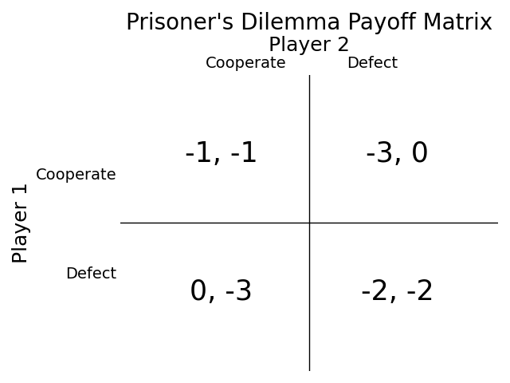

# Iterated Prisoners Dilemma Tournament
A program that runs a tournament were users can create differents strategies to try and score as many points as possible. The points are awarded in each round of each match according to the graph 'Points Payout Matrix'. The 'Tournament.py' file is the program that runs and plots the result of the the tournament between players. Change the 'Player_modules_list' variable in the end of the file to incluse the players you want to play with. A user can try multiple different strategies. The names of the strategies is thier name and and a number to mark each of thier strategies. The 'name.py' file is a code skeleton that explains what each user have to code to make it work.

## Prisoners Dilemma
The Prisoner's Dilemma is a concept in game theory where two individuals, facing criminal charges, must decide whether to cooperate or betray each other. The outcomes depend on their mutual choices. If both cooperate, they get a moderate sentence. If one betrays, they get a lighter sentence, but the other gets a harsher one. If both betray, they both get a somewhat harsh sentence. The dilemma highlights the conflict between individual and collective interests in decision-making.

## Iterated Prisoners Dilemma
In an Iterated Prisoner's Dilemma, the scenario is repeated over multiple rounds. Participants have the opportunity to remember the previous actions of their counterparts. This iterative nature introduces the possibility of building trust or responding reciprocally. Strategies can evolve as individuals adapt based on past interactions, fostering cooperation or competition over time. The dynamics of an iterated Prisoner's Dilemma often lead to more complex strategies and nuanced decision-making compared to a one-shot version.

